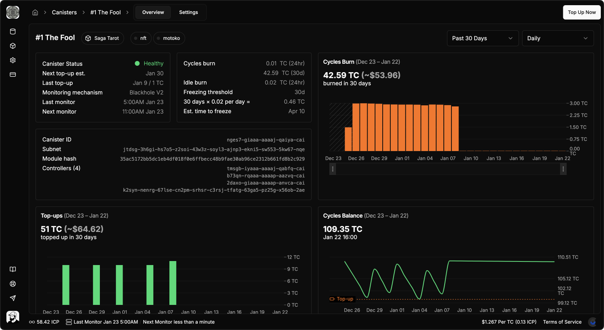
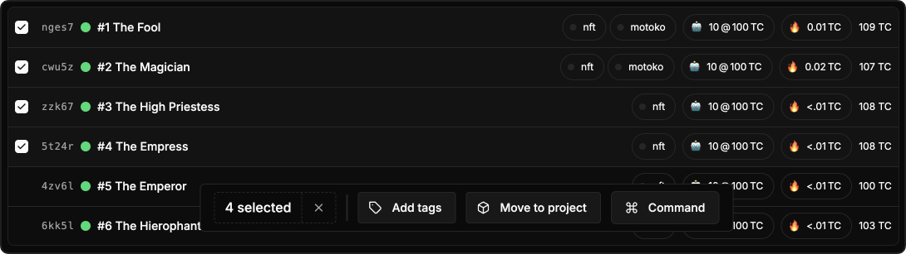
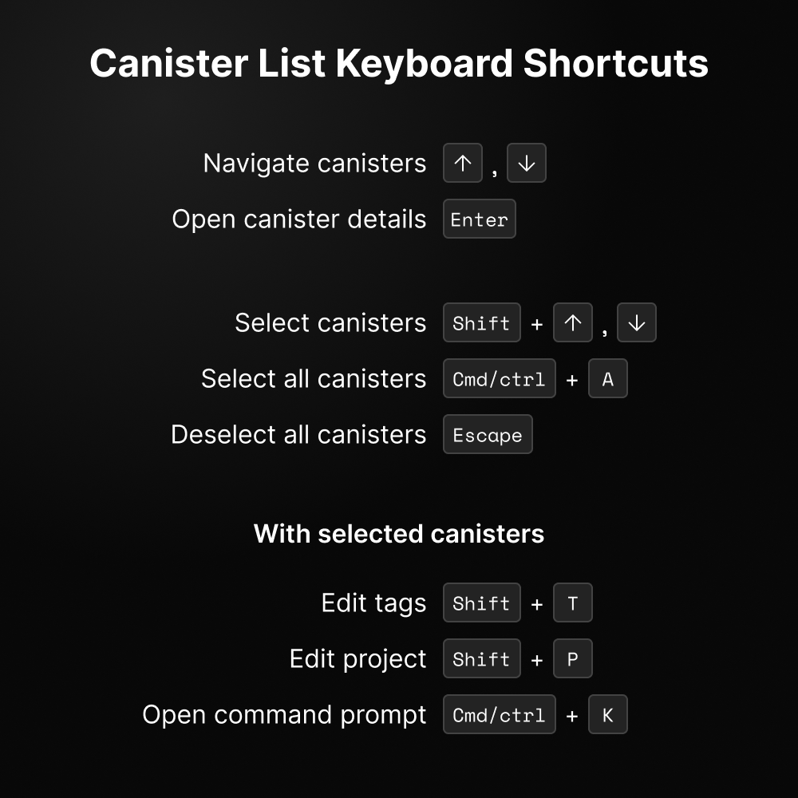

Starting today it's easier than ever to manage a large fleet of canister smart contracts on ICP. We're releasing a new UI for [cycleops.dev](http://cycleops.dev) that can handle hundreds (or even thousands) of canisters, and we've raised our per account canister monitoring limit from 30 to 1,000. Already, teams have integrated fleets of up to 800 canisters for monitoring, alerting, and automated top-ups.

<!-- truncate -->

Our mission at CycleOps is to bring ICP's decentralized compute to market by providing a world class developer experience, and managed solutions for the biggest pain points of builders large and small that want to build on the future of the decentralized web. Making it easy to control large fleets of canisters is a big step in that vision, so let's take a closer look.

### Adding Your Fleet

So you've got a fleet of canisters. How can you connect to CycleOps to get monitoring, alerting, and automated top-ups? I have good news for you: it will only take 5 or 10 minutes, plus a few minutes of running an automated script.

Our CSV upload feature has you covered. All you need to do is create a spreadsheet that lists all your canisters and how you want them to be configured. Don't worry about strictly formatting it, the upload feature will map it into the expected format and allow you to proofread and fix the mapping if necessary. Read the docs for more detail about what columns you can use to customize your CycleOps configuration when adding the CSV upload feature.

### Monitoring Your Fleet

So you've successfully added your fleet, what can you do now? After adding your canisters, you'll have be able to see basic information. CycleOps monitors canisters on a six hour interval, so within a day you'll start to see valuable time series data accumulate for your canisters.

For each canister, CycleOps provides a deep dive view that includes time series metric charts from query calls to your canister, to cycles balance, cycles burn, amount spent on top-ups, and memory usage. You'll also see metrics like current canister health & controllers, as well as estimated time until freeze, next estimated topup, etc.

Your dashboard displays aggregate metrics for all of your canisters, so you can easily see if all your canisters are healthy, how many cycles they're burning and how much you're spending on top-ups.

You can personalize the display of data that's displayed for each of your canisters on the dashboard. By default your dashboard will display burn rate, cycles balance and memory size, estimated freeze date, and more. Perhaps you want to show an estimated next top up for each canister, or the subnet that the canister is deployed on. By clicking on "Display" and choosing a configuration, you're in control.

### Bulk Canister Actions

Working with large fleets of canisters means being able to manipulate them in large batches, and the new CycleOps dashboard UI makes that very easy. You can right click on any canister to edit it, or select a group of canisters to perform an action on the entire set.

As of this release we support batch actions for editing tags and projects. More actions are planned and in development for changing top-up rules, setting memory alert thresholds, sending one-time top-ups, and many other things that you can do on a single canister in CycleOps.

### Keyboard Navigation

The dashboard also supports native-like keybinds for selecting canisters, and action specific keybinds.

