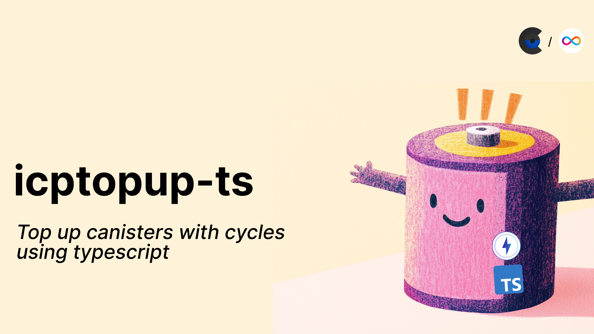

[](/changelog/icptopup-ts)

Today we're releasing [icptopup-ts](https://github.com/CycleOperators/icptopup-ts), a TypeScript package that makes it easy for any app to provide decentralized ICP compute via cycles.

With `npm install icptopup-ts`, you can integrate atomic, ICRC compatible cycle topups into your application in just a few minutes!

<!-- truncate -->

--------------

In the same way that ICPTopup made topping up canisters on demand easy for anyone, icptopup-ts makes it easy to facilitate decentralized compute, sending cycles to up to 100 canisters at a time.

**icptopup-ts** simplifies canister topups into just two steps.

1. [Approving ICP to mint cycles](https://github.com/CycleOperators/icptopup-ts?tab=readme-ov-file#2-approve-icptopup-to-mint-cycles-from-icp-on-your-behalf)
2. [Executing the multi-canister topup](https://github.com/CycleOperators/icptopup-ts?tab=readme-ov-file#4-call-icptopups-synchronous-batchtopupsync-api-or-its-asynchronous-topup-api)

The package comes with flexible primitives for sending cycles depending on your desired UX, and slots easily into both Frontend and NodeJS contexts. Over the past month, developers have already used icptopup-ts to mint and send >30,000T cycles across over 21,000 canister topup events.

### Getting Started

It takes just 4 steps to integrate [icptopup-ts into your application](https://github.com/CycleOperators/icptopup-ts):

1. **Installation:** `npm install icptoup-ts`
2. **Approve funds:** icptopup-ts uses ICRC-2 approve/transfer from, so first start out by approving at least 0.1 ICP to be spent on topups

```typescript
  import ICPTopup from "icptopup-ts";

  // in your function
  const agent = HttpAgent.createSync({ identity, host: "https://ic0.app" });
  const approvalBlockIndex = await ICPTopup.approveToSpendE8s({
    agent,
    e8sToApprove: BigInt(1e7), // approve a minimum of 0.1 ICP
  });
```

3. **Instantiate the ICPTopup Actor**
```typescript
  const agent = HttpAgent.createSync({ identity, host: "https://ic0.app" });
  const icpTopupActor = new ICPTopup(agent);
```

4. **Execute topups** to multiple canisters, with control over the distribution of minted cycles sent to each canister
```typescript
  const result = await icpTopupActor.batchTopupSync({
    // Note: make sure the icp account spent from has enough e8s for the ledger transfer (10_000 e8s)
    e8sToTransfer: BigInt(1e7), // 0.1 ICP
    topupTargets: [
      {
        canisterId: Principal.fromText("qc4nb-ciaaa-aaaap-aawqa-cai"),
        topupProportion: 2n, // send up 2/3rds of the minted cycles here
      },
      {
        canisterId: Principal.fromText("gf3bz-2aaaa-aaaap-ahngq-cai"),
        topupProportion: 1n, // send 1/3rd of the minted cycles here
      },
    ],
  });
```

For more examples, including how to execute asynchronous topups, check out the [icptopup-ts GitHub documentation](https://github.com/CycleOperators/icptopup-ts)

### Benefits of using icptopup-ts

Before icptopup-ts, converting ICP to cycles had the following issues:

1. Minting cycles from ICP is not atomic. Therefore, a topup attempted by a frontend integrated with the CMC could leave a user initiated topup in a half-finished, or inconsistent state if something went wrong during the process.

2. The Cycles Minting Canister (CMC) did not support ICRC transfers, meaning that funds held in user ICRC accounts required two transfers (one to a non-ICRC account, and then another to the CMC) in order to facilitate an ICRC topup, creating additional potential points of failure.

4. The CMC does not have a batch cycles minting API, meaning that the developer needs to handle all complexity associated with batching cycles, incurring additional, unnecessary fees for each individual cycles minting transaction.


icptopup-ts **solves these issues** by providing a simple, atomic, ICRC compatible API for topping up canisters in batch.

### How does it work?

Under the hood, icptopup-ts is built on top of the [ICPTopup Service](https://forum.dfinity.org/t/icptopup-com-the-easiest-way-to-top-up-canisters-with-cycles/36434), integrating with fixed APIs on the backend ICPTopup canister. The ICPTopup canister provides unified, atomic topup APIs that handling ICRC ICP transfer, cycle minting, and parallel batch cycles distribution to canisters.

### What's next?

We're looking forward to seeing what you build with icptopup-ts! If you have any questions, requests, or feedback, [file an issue](https://github.com/CycleOperators/icptopup-ts/issues/new) or reach out to us [@CycleOps on X](https://x.com/CycleOps).

