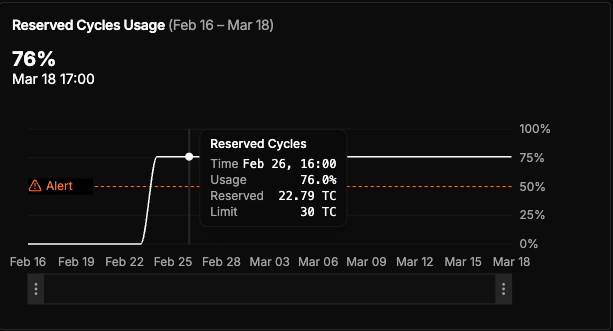
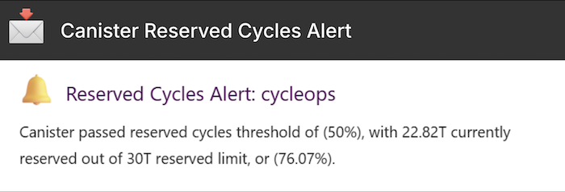
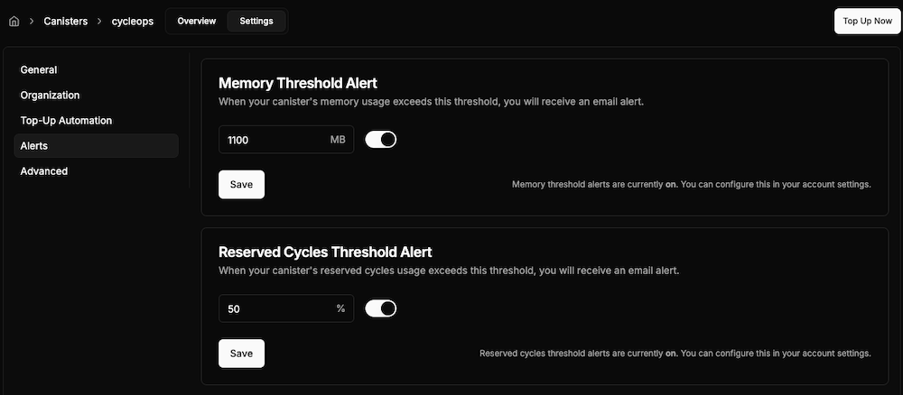

[](/changelog/reserved-cycle-alerts)

Did you know that your canister can suddenly stop saving new data ❌ if it’s on a busy subnet and you haven’t set it up to reserve enough cycles for new memory allocations? 🫢 

With CycleOps’ new reserved cycles monitoring and alerts 🚨, you can proactively manage reserved cycles limits for your canisters, keeping them running smoothly and avoiding unexpected downtime 🔋🔋🔋


<!-- truncate -->

------

### What Are Reserved cycles?
* **reserved_cycles:** A dedicated, non-transferable cycles pool of a canister that "pays ahead" for newly allocated canister memory **when the subnet that canister is on has allocated more than 450GiB of memory** 

* **reserved_cycles_limit:** An upper limit and spending cap on how many cycles can be `reserved_cycles`, or set aside to pay for future storage. This limit controls whether (and how much) new canister storage can be allocated once a subnet’s memory has grown beyond 450GiB. <br/><br/> ✍️ &nbsp; Note: By default, a canister has a reserved cycles limit of 5 trillion cycles.

### What happens when I run out of reserved cycles?

If a canister hits its reserved cycles limit or is running low on cycles, it may fail to commit state, producing errors ❌ such as:
* ["Reserved cycles limit exceeded in memory grow"](https://internetcomputer.org/docs/references/execution-errors#reserved-cycles-limit-exceeded-in-memory-grow)
* ["Reserved cycles limit exceeded in memory allocation"](https://internetcomputer.org/docs/references/execution-errors#reserved-cycles-limit-exceeded-in-memory-allocation) 

### How To Use CycleOps Reserved Cycle Alerts
CycleOps collects historical reserved cycles data, allowing you to view your canister's reserved cycles usage over time 📈, measured as a percentage ％ of overall usage towards your canister's reserved cycles limit.

 

When your canister passes its reserved cycles percentage alert threshold, you'll receive an alert if you have 📩 email alerts enabled.



In CycleOps 👁️‍🗨️, you can also modify your reserved cycles alert percentage threshold from a specific canister's alerts tab.



To update your canister's reserved cycles limit through dfx, use the command:
```
dfx canister --ic update-settings --reserved-cycles-limit <new_reserved_cycles_limit> <canister>
```


### Background on Reserved Cycles and ICP's Resource Reservation Mechanism
Historically, canisters on the Internet Computer paid for storage in a “pay-as-you-go” manner:
As a canister writes to heap or stable memory 📝, it burns cycles to pay for that storage 🔥.


While convenient, this model was vulnerable to spiky storage usage patterns: a canister could temporarily allocate a large amount of subnet storage, hold it for a few hours, and then drop it's memory usage or even uninstall the canister at relatively little cost. This could disrupt other canisters 🙅‍♂️ if a subnet's storage was “fully booked,” even if only for a short time.

Released in late 2023, The new [resource reservation mechanism](https://forum.dfinity.org/t/increasing-subnet-storage-capacity-and-introducing-resource-reservation-mechanism/23447) is designed to discourage these sudden large spikes in storage usage by requiring canisters to “front-load” some of the storage costs 💰 when the subnet is already heavily used. If you truly need long-term storage, you won’t pay more overall, but short-term “spikes” become more expensive up front.


### A home for your canisters

Our goal is to make [cycleops.dev](https://cycleops.dev) the easiest way to monitor and manage your canisters. As the protocol evolves, we'll continue to add new metrics, keeping your canisters running and keeping you focused on building great dapps!

### Connect with us

Find us [@CycleOps on X](https://x.com/CycleOps) and let us know what metrics and alerts you'd like to see us build next!
