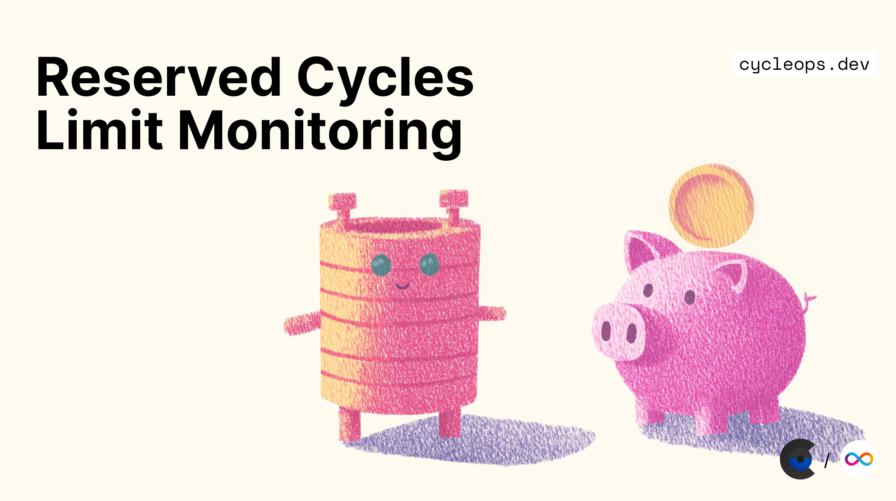

Did you know that your canister can suddenly stop saving new data if it’s on a busy subnet and you haven’t set it up to reserve enough cycles for new memory allocations?

CycleOps now has monitoring and alerting features to help you stay on top of the important but lesser-known "reserved cycles" canister configuration. Here's everything you need to know about reserved cycles, and how you can set up alerts for them in just a few minutes!

<!-- truncate -->

## What are reserved cycles?

Released in late 2023, the reserved cycles mechanism was designed to prevent a few canisters from easily consuming all the storage on a subnet. When a subnet is nearing capacity, canisters on that subnet must begin paying in advance for any additional storage and do so by automatically transferring some of their cycles into a dedicated “reserved cycles” pool.

Each canister can be configured to set a maximum size for its reserved cycles pool, which is known as a canister's `reserved_cycles_limit` configuration. All canisters have a reserved cycles limit of 5 trillion cycles (TC) by default.

## What happens if I run out of reserved cycles?

A canister which hits its reserved cycles limit will no longer be able to commit new state. This means that write endpoints will begin to fail, which can cause all sorts of production errors. You can see the types of execution errors that would occur in these instances in the official documentation:

- ["Reserved cycles limit exceeded in memory grow"](https://internetcomputer.org/docs/references/execution-errors#reserved-cycles-limit-exceeded-in-memory-grow)
- ["Reserved cycles limit exceeded in memory allocation"](https://internetcomputer.org/docs/references/execution-errors#reserved-cycles-limit-exceeded-in-memory-allocation)

## Introducing reserved cycles monitoring and alerting

Our new features are designed to keep these reserved cycles errors from happening. Reserved cycles monitoring insights are available for all canisters, and allow you to easily see if any of your canisters are approaching their limit.

[Screenshot of reserved cycles time series insight](https://www.notion.so/Reserved-Cycle-Alerts-1bb49867d8ff807f9b8efb98271b5254?pvs=21) (TODO)

Reserved cycles limit alerts will send you an email alert if any canisters cross a configurable threshold of a certain percent of their total reserved cycles limit.

[Recording of reserved cycles limit alert configuration](https://www.notion.so/Reserved-Cycle-Alerts-1bb49867d8ff807f9b8efb98271b5254?pvs=21) (TODO)

By enabling these alerts, CycleOps will make sure that you receive ample notification before this type of production error hits your canisters. Don't wait for subnet load to break your canisters, set up your alerts now! It will only take a few minutes.

[How to enable reserved cycles limit alerting for your canisters](TODO: create and link to a page in the docs site, and create a new batch action.)

---

## Further Reading

[This original forum post](https://forum.dfinity.org/t/increasing-subnet-storage-capacity-and-introducing-resource-reservation-mechanism/23447) remains the best place for documentation on this feature if you want to dive deeper into the details. Have questions about reserved cycles? Ask a question on this thread, or ping us on X!

## Connect with us

Find us [@CycleOps on X](https://x.com/CycleOps) and let us know what metrics and alerts you'd like to see us build next!