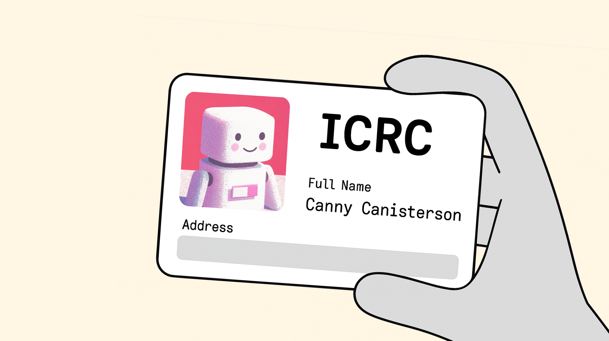
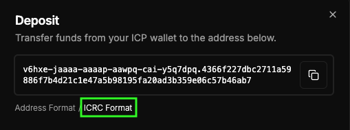

Today, we're rolling out ICRC deposits for CycleOps, meaning you can fund topups directly from your SNS with a single Transfer SNS Treasury Funds proposal 🎉

<!-- truncate -->

## Why we built it

Some newer Internet Computer apps don't support the old "account ID" format for transfering ICP, prefering instead to use addresses in the newer ICRC format. Until now CycleOps payments only used the account ID format, which was a pain when using those backwards incompatible UIs (including the default SNS treasury management UI).

CycleOps now provides your payment address in either format, so SNS's can fund more easily fund the CycleOps accounts directly from their treasury.

## How do I find my CycleOps ICRC account principal?

1. Navigate to the Billing -> Payment tab
2. Under "ICP Top-Up Account", click on Deposit
3. Select "ICRC Format", and copy your ICRC principal

## How do I send funds to my CycleOps ICRC account principal?

1. [Find and copy your principal](#how-do-i-find-my-cycleops-icrc-account-principal)
2. Send funds to this principal (Having trouble? See note below)

:::note
CycleOps account ICRC principals use subaccounts, which are supported by several applications, including the NNS and applications like SNS toolkit. At this point in time, not all wallets support ICRC subaccounts.

If your wallet does not support sending to ICRC accounts with subaccounts, you can alternatively send funds to your CycleOps account by clicking on "Address Format" and copying the account identifier
:::

## Ready to streamline your SNS treasury management?

Head over to your [CycleOps dashboard](https://cycleops.dev/app/) to set up ICRC deposits for your SNS canisters. Need help getting started? Find us [@CycleOps on X](https://x.com/CycleOps) and we'll guide you through the process.

## Further reading

If you want to learn more about address formats in the ICRC standard, see the [documentation on the ICRC-1 standard](https://internetcomputer.org/docs/references/icrc1-standard#non-default-accounts).
