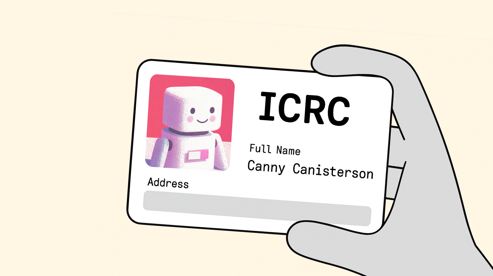
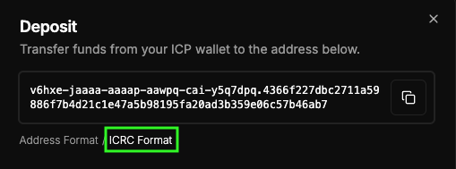

Today, we're rolling out ICRC deposits for CycleOps, meaning you can fund topups directly from your SNS with a single Transfer SNS Treasury Funds proposal 🎉

<!-- truncate -->

## Why we built it

Some newer Internet Computer apps don't support the old "account ID" format for transfering ICP, prefering instead to use addresses in the newer ICRC format. Until now CycleOps payments only used the account ID format, which was a pain when using backwards incompatible APIs for ICP transfers (including the default SNS treasury management proposals).

CycleOps now provides your payment address in either format, so SNS's can fund more easily fund their CycleOps accounts directly from their treasury.

## How do I find my CycleOps ICRC account?

1. Navigate to the Billing -> Payment tab
2. Under "ICP Top-Up Account", click on Deposit
3. Select "ICRC Format", and copy your ICRC account

## How do I send funds to my CycleOps ICRC account?

1. [Find and copy your accountl](#how-do-i-find-my-cycleops-icrc-account)
2. Send funds to this account (Having trouble? See note below)

:::note
CycleOps ICRC accounts use subaccounts, which are supported by several applications, including the NNS and applications like SNS toolkit. At this point in time, not all wallets support ICRC accounts that include subaccounts.

If your wallet does not support sending to ICRC accounts with subaccounts, you can alternatively send funds to your CycleOps account by clicking on "Address Format" and copying the account identifier
:::

## Ready to set up funding straight from your SNS treasury?

1. Head over to your [CycleOps dashboard](https://cycleops.dev/app/) to set up ICRC deposits for your SNS canisters.
2. [Locate your your ICRC account](#how-do-i-find-my-cycleops-icrc-account)
3. If using an application like SNS toolkit, directly copy in the full ICRC account.

:::note
If creating a treasury proposal manually, you can copy in the principal and subaccount, which are separated by `-<crc_checksum>.` characters.

For example, if my: 

ICRC account = `v6hxe-jaaaa-aaaap-aawpq-cai-y5q7dpq.4366f227dbc2711a59886f7b4d21c1e47a5b98195fa20ad3b359e06c57b46ab7`

then the individual parts are

principal = `v6hxe-jaaaa-aaaap-aawpq-cai`  
checksum = `y5q7dpq`  
subaccount = `4366f227dbc2711a59886f7b4d21c1e47a5b98195fa20ad3b359e06c57b46ab7`
:::

Need help getting started? Find us [@CycleOps on X](https://x.com/CycleOps) and we'll guide you through the process.

## Further reading

Want to learn more about ICRC account formats? Check out the [documentation on the ICRC-1 standard](https://internetcomputer.org/docs/references/icrc1-standard#non-default-accounts).
