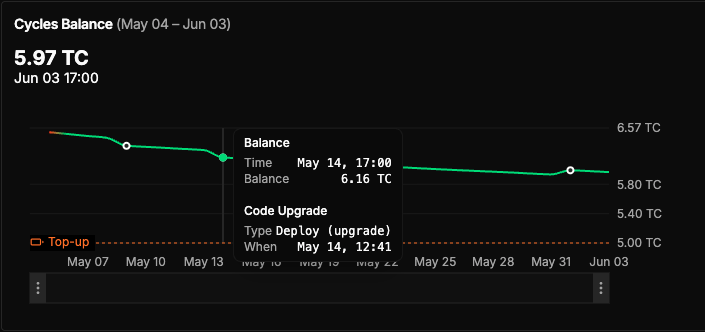
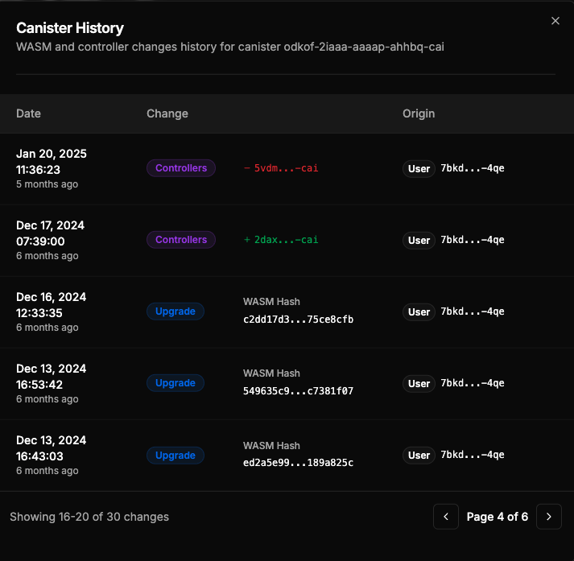

Spot the metric anomaly, trace it to a code update, and uncover the bug—your CycleOps dashboard just got x‑ray vision.

Today, we’re excited to announce a direct integration with **Research‑AG’s canister [History Tracker](https://history.ic0.info/)**, allowing developers to connect memory spikes and cycle burn surges back to the exact deployments that triggered them.

<!-- truncate -->

## What We Shipped

CycleOps now integrates **Research‑AG’s History Tracker** for every canister in your account. 0 extra setup—just richer insights:

* **Code revisions**: view each WASM hash and its deploy timestamp
* **Controller events**: view additions & removals, with the actor who made the change
* **Metric overlays**: code change events are layered directly onto your cycle balance chart, making it easy to correlate metrics with code updates.

## Why It Matters

Correlate *what changed* with *what broke (or improved)*:

* Memory spikes, cycle burn surges, latency drops—see the exact deployment that triggered them.
* Shared canister? Third‑party logs provide an immutable audit trail for controller changes, perfect for multi‑dev team ops or post‑mortems.

## How You Can Use It

1. **Open any canister** in your CycleOps dashboard.
2. Scroll to the **Cycle Balance time series chart—history markers are auto‑overlaid.**
3. Click **History** (top‑right) for a full chronological view, complete with diffable WASM hashes and controller metadata.

That’s it. New accounts get history tracking out of the box, and existing accounts already have it enabled—just refresh and explore.

## Kudos
Huge thanks to Timo Hanke and the [Research‑AG](https://x.com/mr_research_ag) team for building the History Tracker service, and for their support during the integration.

---

Ready to level‑up your observability? [Get started](https://docs.cycleops.dev/docs/getting-started) with CycleOps today.

Have feedback? Join the conversation on **[OpenChat](https://oc.app/community/tw3lb-zqaaa-aaaar-ar3aa-cai/?ref=xeivw-sqaaa-aaaaf-adr7a-cai)** or tag us on **[X](https://x.com/CycleOps)**.