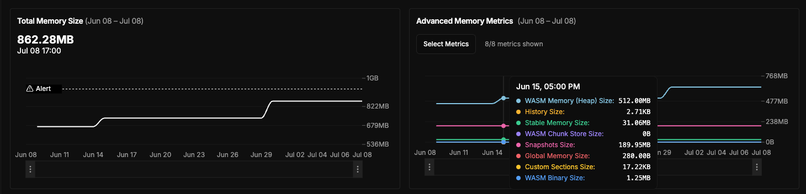
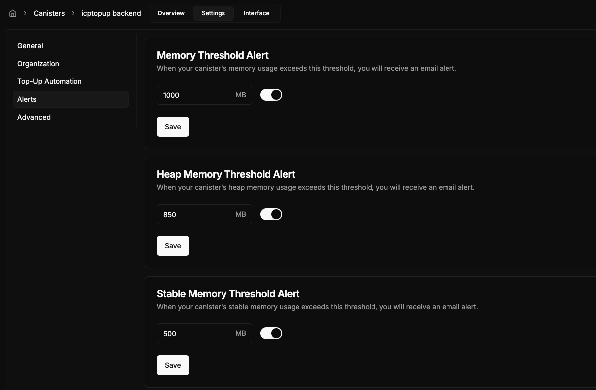
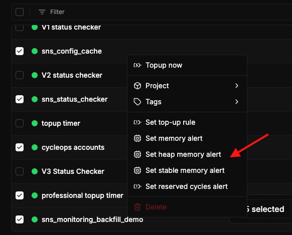

Heap overflow anxiety &mdash; gone. The new CycleOps V3 Blackhole adds 8 new in-depth memory metrics, with heap and stable memory alerts that keep your canister's data healthy and cost‑efficient.

<!-- truncate -->

---
### New Memory Metrics
Every canister [with monitoring upgraded to the V3 Blackhole](/docs/blackhole-upgrade) now reports **eight new memory fields**, in addition to an aggregate total

The new memory fields tracked include
- `wasm_memory_size` - Tracks memory used by the WebAssembly module.
- `stable_memory_size` - Captures memory stored persistently across upgrades.
- `global_memory_size` - Monitors memory allocated for global variables.
- `wasm_binary_size` - Shows the size of the deployed WebAssembly binary.
- `custom_sections_size` - Reports the size of custom sections in the Wasm binary.
- `canister_history_size` - Tracks memory used by the canister's historical data.
- `wasm_chunk_store_size` - Measures storage used by Wasm chunking mechanisms.
- `snapshots_size` - Monitors memory usage by stored snapshots.

### How Do these metrics help me?
Different components of canister memory have different protocol limits. For example,
- Wasm (heap) memory size - 4GB (or 6GB for wasm64 canisters)
- Wasm binary size - 100MB
- Stable memory size - 500GB (can up to as large as the single canister limit)

Understanding these memory limits and using CycleOps to monitor and set appropriate alert thresholds allows you to:
- **Catch leaks early:** use memory alerts surface spikes in heap or stable memory immediately
- **Save money:** visualize and optimize memory growth over time, saving on storage cycle costs.
- **Avoid catastrophic overflows:** Canister heap memory overflows are extremely hard to recover from. Set up heap memory alerts in CycleOps to migrate canister memory before it's too late!

### What about email alerts?
Quickly set up memory email alerts for individual canisters by clicking on the canister -> settings -> alerts.

Or for multiple canisters at a time by selecting a few canisters and pulling up the batch actions menu with (⌘ + K) or right click.

### How can I upgrade?

Each of these metrics provides deeper insight into memory distribution, helping teams optimize their canister deployments.

If you have any canisters that are eligible for a monitoring upgrade, you will be prompted to go through the upgrade wizard when you sign in. You can alternatively upgrade monitoring metrics with the batch actions menu or on the individual canister metrics page.

Continue reading [here to learn more blackhole upgrades](/docs/blackhole-upgrade).

