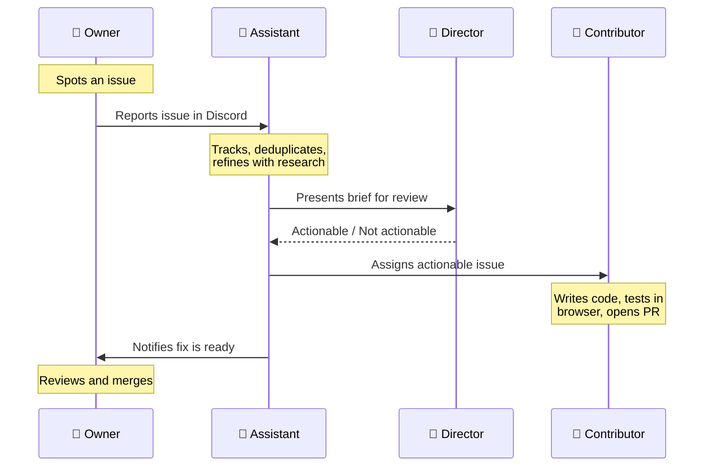

We operate [CycleOps](https://cycleops.dev) and [ICPTopup](https://icptopup.com) as a tiny distributed team (two founders and some contractors). Like most small teams, we've always had more product improvements queued up than we could get to. UI papercuts, customer-reported bugs, and small polish work can be the difference between a product that feels good and one that feels neglected.

Since February, we've been shipping 5-10 of these incremental fixes every week, with most of the work done by AI agents. We took a continuous improvement process we've been running for years and adapted it so that agents handle the heavy lifting while humans stay in charge of the decisions that require taste, product context, and long term engineering perspective.

This article is a walkthrough of how we moved this process to agents, what is working, and what we want to do next.

<!-- truncate -->

## It Started With a Process We Already Had

For a few years now, we've run an internal process we call "kaizen", borrowed from Toyota's philosophy of continuous, compounding improvement. The idea is simple: observe the product → spot issues → prioritize them → fix them → ship → repeat. We had it fully documented with four defined roles and a clear lifecycle that every issue followed.

When we started looking at what agents could take over, we didn't design a new system. We looked at our existing process and asked which of the four roles could be done by an agent. The answer was two: the project management work and the coding work. The other two (spotting issues and deciding what's worth fixing) stayed with humans, for now.

## How It Works

**The Owner** is anyone on the team who notices something off. You report it in Discord — a sentence or two is enough — and the system picks it up.

*A customer reports a UI inconsistency in Discord. The Assistant bot deduplicates and creates a GitHub issue automatically.*

**The Assistant** is an AI agent (his name is Canny) that acts as project manager. He lives in our Discord and watches for new reports. When one comes in, he creates a GitHub issue, checks for duplicates, and then goes and does the research a human PM would do: he pulls session recordings from PostHog, tries to reproduce the bug in a real browser, reads the relevant source code, and writes up acceptance criteria. Once he has a clear picture, he sends the Director a brief with a recommendation.

*The Assistant presents an issue brief to the Director for review. A quick 👍 or 👎 keeps the pipeline moving.*

**The Director** is human. They look at the Assistant's brief and decide: is this worth doing? This is where product judgment lives. Some issues are clear cut improvements, but some issues require additional design thinking.

**The Contributor** is another AI agent, this one focused entirely on writing code. It picks up issues that the Director has approved, reads the codebase, writes a fix, tests it in a browser, takes screenshots showing the fix works, and opens a PR. If the PR gets rejected, the issue goes back through the loop with feedback.

*The Owner gets pinged when a fix is ready. Review the PR, merge, ship.*

## The Tools

The Contributor runs on [GitHub Agentic Workflows (gh-aw)](https://github.github.io/gh-aw/), GitHub's framework for running AI agents inside Actions. Everything is configured in markdown, agents run in sandboxed containers, and write operations go through approved outputs. We use Claude Code as the underlying model, which has given us the best results for well-scoped coding tasks.

The Assistant runs on [OpenClaw](https://docs.openclaw.ai), a self-hosted gateway that gives an AI agent its own computer. We need this for the Assistant because its job is broad—it browses PostHog, tests things in a real browser, manages GitHub issues, and messages people on Discord and Telegram. The nice thing about an agent with its own computer is that updating the process is as easy as sending it a message. Want weekly shipping reports? Tell it on Telegram. Want to change how issues get prioritized? Same thing. It updates its own protocols.

## What We've Learned

**The process documentation was the hard part, and we'd already done it.** Our written kaizen process (roles, lifecycle stages, decision criteria) essentially became the system prompt for the whole pipeline. If we hadn't documented this years ago for our own human team, setting this up with agents would have been dramatically harder. If you're thinking about doing something similar, start there.

**Issue refinement is arguably where agents add the most value.** Converting a one-line Discord message into a well-researched GitHub issue with reproduction steps, root cause analysis, and clear acceptance criteria used to cost us anywhere from five minutes to an hour per issue, depending on complexity. Canny handles all of that now. And the better the issue is written, the better the Contributor's code turns out, so this step compounds.

**Humans currently need to stay on prioritization.** Agents will cheerfully ship issues that lack fundamental product thinking. The Director role exists specifically to prevent that. Every issue gets a human review before any code gets written. As models improve and as our team more clearly understands the fundamental context problem, there should be less and less work for the humans to do at this step.

**It doesn't need to work perfectly.** The Contributor writes broken code sometimes. The Assistant loses track of issues occasionally. That's fine... the process has review cycles and human checkpoints that catch failures. Even at imperfect reliability, the throughput gain is massive.

## Where It Falls Short

Canny the OpenClaw agent in particular can be inconsistent, and we're experimenting with moving some of its responsibilities into more deterministic, purpose-built components.

The process is handling frontend fixes well, but we've intentionally restricted agents from touching our backend systems so far.

That said, for what it does cover, it's been worth it many times over. We're delivering a level of product polish that we genuinely could not achieve without this, not at our team size.

---

*If you use [CycleOps](https://cycleops.dev) or [ICPTopup](https://icptopup.com) and notice something that could be better, hit the feedback button. It goes straight into this pipeline, and you'll typically see your improvement shipped within a week (if it's actionable).*

*If you want to build something like this for your own team, we're happy to go deeper on the technical details. Feel free to [reach out](https://x.com/CycleOps)!*
