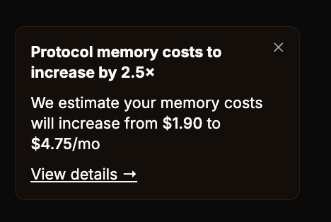
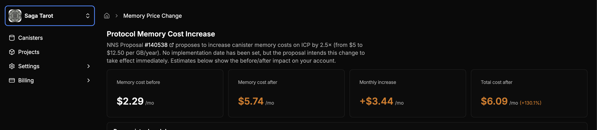
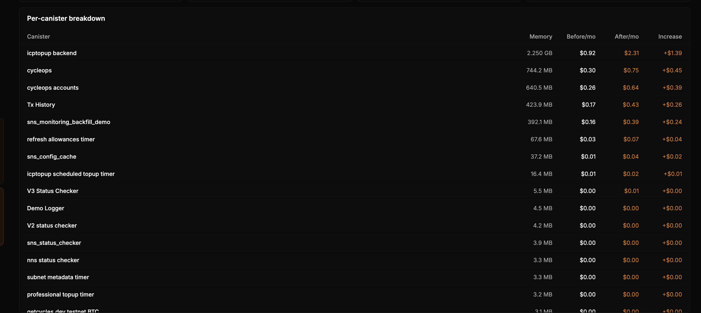

Memory Costs on ICP Are Changing, and you might be thinking "what does this mean for my cycle bill"?

We were wondering the same thing, so CycleOps now includes a dedicated **Memory Price Change** view so teams can quickly understand the impact of the upcoming [ICP protocol memory pricing](https://nns.ic0.app/proposal/?u=qoctq-giaaa-aaaaa-aaaea-cai&proposal=140538) update.

<!-- truncate -->

## How does this affect my canisters?

[NNS Proposal #140538](https://nns.ic0.app/proposal/?u=qoctq-giaaa-aaaaa-aaaea-cai&proposal=140538) proposes to increase canister memory costs on ICP by 2.5× (from $5 to $12.50 per GB/year).

While no implementation date has been set, we've provided a tool in CycleOps that you can use to better understand how this will affect your monthly canister costs.

## How to view your projected memory increase

Upon logging in, you should see a notification on the left-hand side of the app about your account's monthly memory cost changes.

Click on **"View details"** to see an account-wide and per-canister breakdown of your projected memory costs before and after the protocol changes take effect.

### Account Wide & Per Canister Memory Cost Metrics

**Important: Data on this page is estimated. Protocol memory cost increases have been proposed but are not currently in effect.**

The new memory cost page displays estimates on an account-wide and per-canister basis before and after the protocol change.
Keep in mind that these estimates will change as new canisters are added and as existing canisters use more memory.

At the top, you'll find aggregated, **account-wide** monthly estimates for:
- Before/After memory cost
- Memory cost increase amount
- **Total cycle costs (memory + compute)**, and the percent change in those monthly totals after memory costs increase

Additionally, you'll find a **per-canister cost impact table** sorted by canisters with the largest memory-related cost increase.

## Closing thoughts

While a 2.5× change sounds large in isolation, every application and canister has a different cost breakdown.
Understanding projected costs can help you identify your most impacted services and realize future cost savings.

---

Have feedback or questions about the new memory cost tool? Reach out on [X](https://x.com/CycleOps) or in [OpenChat](https://oc.app/community/tw3lb-zqaaa-aaaar-ar3aa-cai/?ref=xeivw-sqaaa-aaaaf-adr7a-cai).
