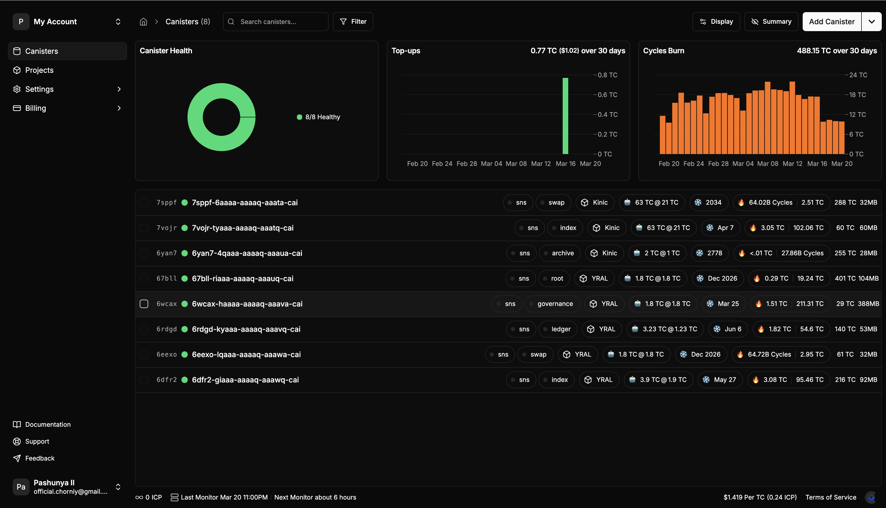
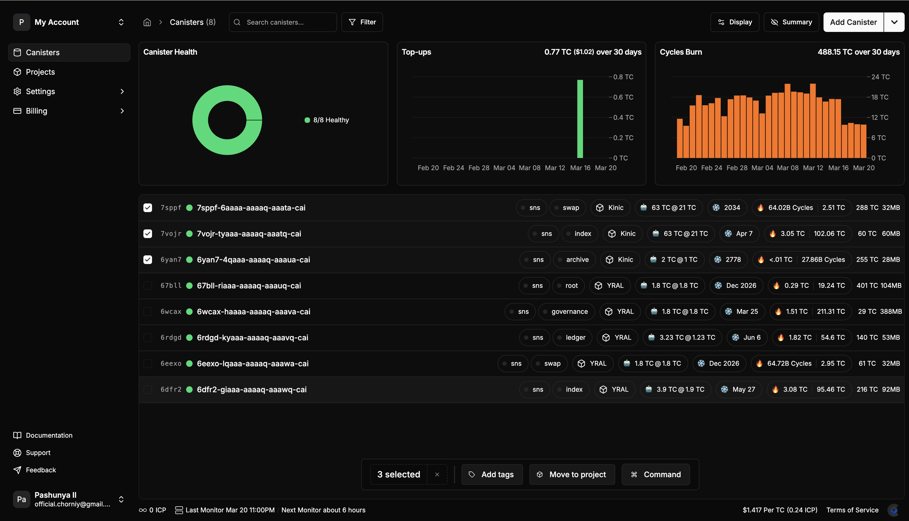
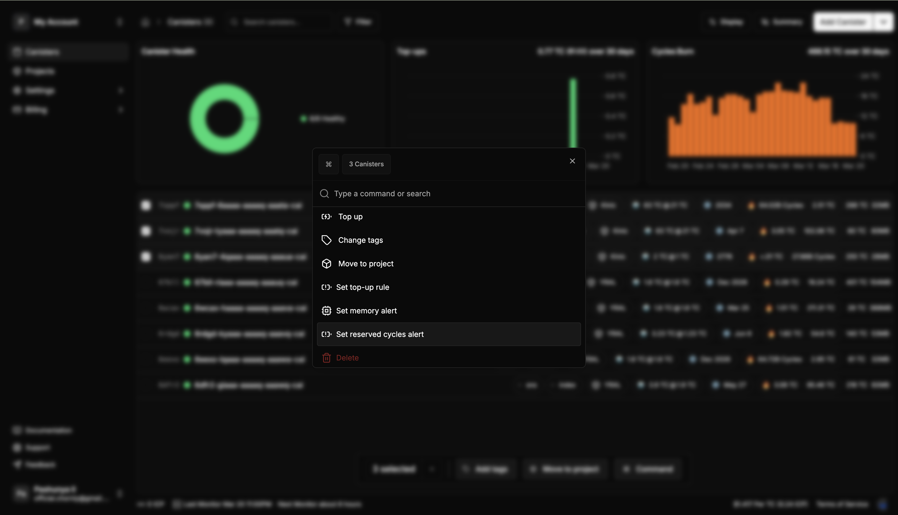
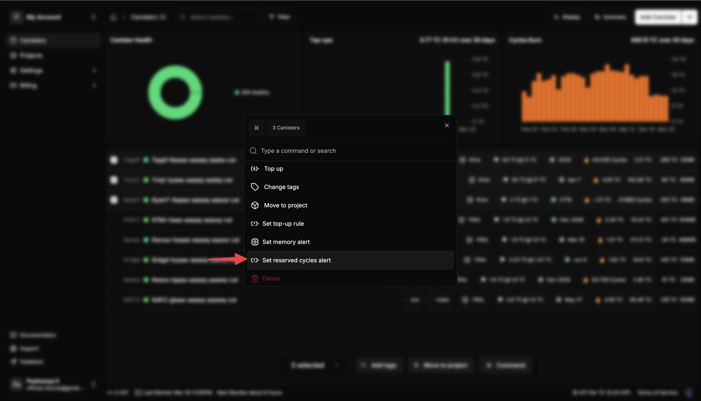
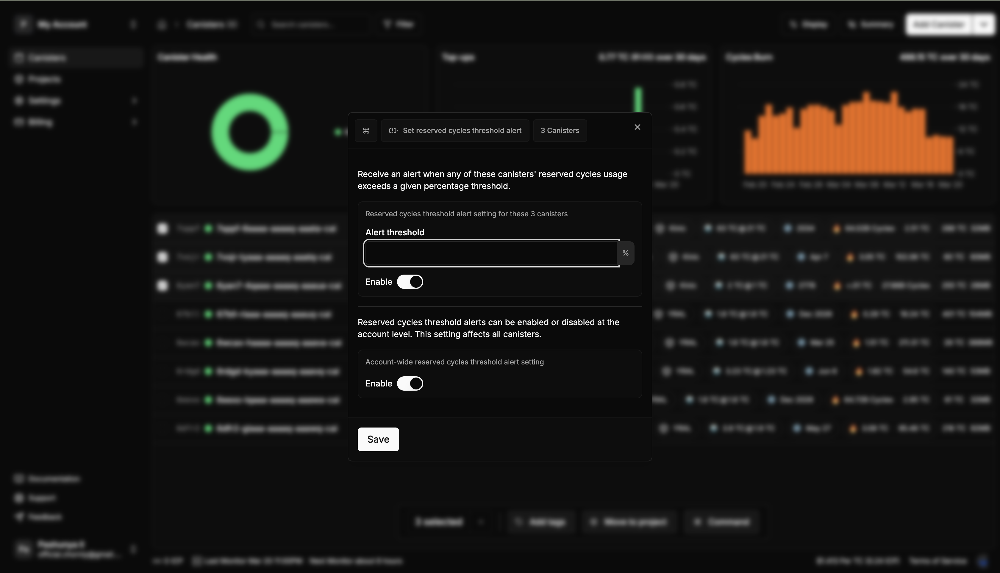
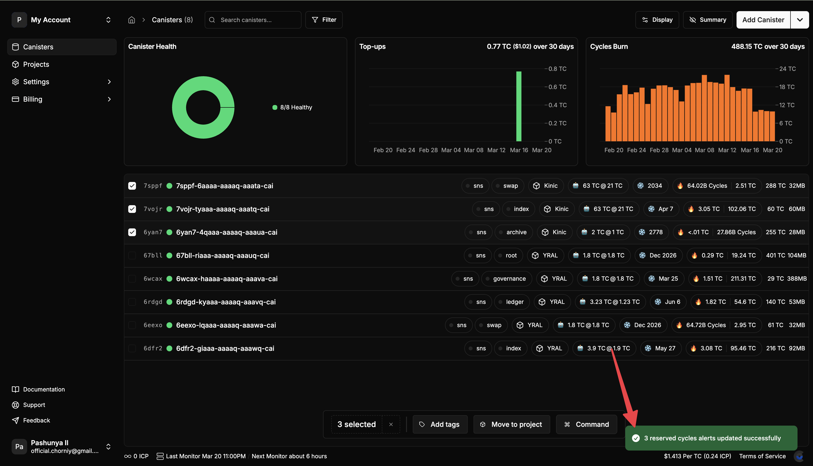

# How to Enable Reserved Cycles Limit Alerting for Your Canisters

Did you know that your canister can suddenly stop saving new data if it's on a busy subnet and you haven't set it up to reserve enough cycles for new memory allocations?

CycleOps now has monitoring and alerting features to help you stay on top of the important but lesser-known "reserved cycles" canister configuration. Here's everything you need to know about reserved cycles, and how you can set up alerts for them in just a few minutes!

## Prerequisite:
Reserved Cycles Monitoring is available for all canisters monitored via:
* the [CycleOps blackhole version >= V2](https://github.com/cycleoperators/balanceCheckerVerification/)
* the SNS
* the NNS.

If you're canister is currently monitored via the [V1 blackhole](https://github.com/cycleoperators/balanceCheckerVerification/), you can enable monitoring by [upgrading to the latest version of the blackhole](https://docs.cycleops.dev/docs/blackhole-upgrade/).

## Video Guide: Enable Reserved Cycles Limit Alerts on Your Canisters

<video width="100%" controls playsinline preload="metadata">
  <source src="/reserved-cycles-alert-video.webm" type="video/webm" />
  <source src="/reserved-cycles-alert-video.mp4" type="video/mp4" />
  <p>Your browser does not support the video tag. You can <a href="/reserved-cycles-alert-video.mp4">download the video</a> to watch it on your device.</p>
</video>

## Step-by-Step Guide: Enabling Reserved Cycles Limit Alerting

### 1. Navigate to Your Dashboard

Log in to your CycleOps account and go to the main dashboard where your canisters are listed.



### 2. Select Multiple Canisters

To set up alerts for multiple canisters at once, you can either:

- Right-click on a canister to open the context menu for a single canister
- Use the checkboxes to select multiple canisters you want to configure at once



### 3. Open Command Menu

You can access the command menu in two ways:

- Press CMD + K (or CTRL + K on Windows/Linux)
- Click "Command" on the appeared bottom panel



### 4. Choose Reserved Cycles Alert Settings

In the command menu, select "Set reserved cycles alert" option.



### 5. Enable Reserved Cycles Limit Alerting

In the alert configuration dialog, you'll see two sections:

1. **Top Section - Canister-Specific Settings**:

   - Toggle to enable/disable alerts for the selected canister(s)
   - Input field to set your desired threshold percentage (e.g., 80% means you'll be alerted when a canister reaches 80% of its reserved cycles limit)

2. **Bottom Section - Global Account Settings**:
   - Toggle to enable/disable reserved cycles alerts globally for your account



### 6. Save Your Configuration

After configuring your alert settings, click the "Save" button to apply your configuration to the selected canister(s).

### 7. Confirm Success

You should see a success notification confirming that your alert settings have been applied to the selected canisters.



> **Note**: You can also configure reserved cycles limit alerts for individual canisters by going to each canister's details page, navigating to the "Alerts" tab, and setting up the alert there.

## What are reserved cycles?

The reserved cycles mechanism was designed to prevent someone from consuming all the storage on a subnet. As a subnet begins to run out of space, canisters must start to pay for their future use of storage on the subnet. To do this, canisters will automatically begin placing some of their cycles into a "reserved cycles" pool.

Each canister can be configured to set a maximum size for its reserved cycles pool, which is known as a canister's `reserved_cycles_limit` configuration. All canister have a reserved cycles limit of 5 trillion cycles (TC) by default.

## What happens if I run out of reserved cycles?

A canister which hits its reserved cycles limit will no longer be able to commit new state. This means that write endpoints will begin to fail, which can cause all sorts of production errors. You can see the types of execution errors that would occur in these instances in the official documentation:

- ["Reserved cycles limit exceeded in memory grow"](https://internetcomputer.org/docs/references/execution-errors#reserved-cycles-limit-exceeded-in-memory-grow)
- ["Reserved cycles limit exceeded in memory allocation"](https://internetcomputer.org/docs/references/execution-errors#reserved-cycles-limit-exceeded-in-memory-allocation)

## How to set your canisters' reserved cycles limit

This setting is managed on your canister in the same way as freezing threshold and other settings.

To update your canister's reserved cycles limit through dfx, use the command:

```
dfx canister --ic update-settings --reserved-cycles-limit <new_reserved_cycles_limit> <canister>
```
