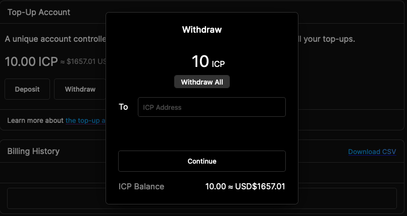

# Top-up Account

Your top-up account is how you pay for cycles top-ups for your canisters. The account currently supports ICP.

We aquire cycles as cheaply as possible behind the scenes, and send these cycles to your canisters in exchange for ICP from your top-up account. All you have to do is add ICP, and we take care of getting the best possible price on cycles for you.

## Top-up Account Address

Your top-up account is held by the CycleOps accounts canister, and it has a unique address. You can use the unique address to send ICP to your top-up account from the NNS, your wallet, an exchange, or anywhere else that you hold ICP.

Your top-up account address can be found under Billing in the web app: [cycleops.dev/app/personal/billing](https://cycleops.dev/app/personal/billing).

## Depositing Funds

You can send ICP to your CycleOps top-up account address by transferring ICP from any account that you currently hold ICP.

You can do this through:

1.  The GUI of your preferred wallet

or

1.  via dfx → `dfx ledger transfer --amount <amount> --memo 0 <cycleops_account>`

## Withdrawing Funds

You can withdraw any unspent funds from your account at any time using the webapp: [cycleops.dev/billing](https://cycleops.dev/billing). Withdrawals will currently be sent to the wallet address of your choosing.

## Keep It Topped!

If there are insufficient funds to pay for the cycles required by your canisters, the top-up will fail. We will send as many cycles as your top-up account will cover, so in fact a partial top-up will occur.

To help you stay on top of things, notifications can be configured to be let you know of top-up failures, or when your top-up account balance starts to get low. Your notification settings can be managed in the webapp: [cycleops.dev/app/personal/settings](https://cycleops.dev/app/personal/settings).

## Accounting & Transaction Logs

Your top-up account does not change, so it’s easy to identify in your accounting. We keep track of all deposits, withdrawals and charges to your top-up account for a minimum of one year in the web app, and historical data is available upon request. Your transaction logs include:

- Withdrawals: any time you withdraw funds from your top-up account
  - The ICP transaction ID, which can be used to recover core transaction data
  - ICP to USD price at the time of transaction
- Deposits: any time funds are sent to your top-up account
  - The ICP transaction ID, which can be used to recover core transaction data
  - ICP to USD price at the time of transaction
- Charges: any time your account is charged to pay for canister top-ups
  - Canister ID
  - Cycles sent
  - Cost in ICP (or Cycles, if your payment method uses the cycles ledger)

You can access your transaction logs via the “billing” tab screen of https://cycleops.dev/app/personal
