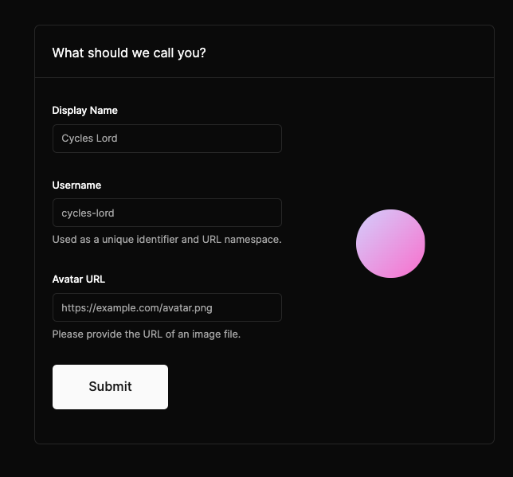
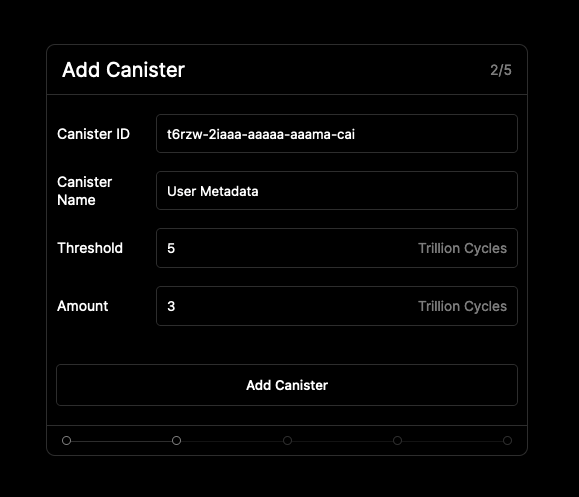
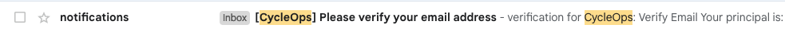

# Caffiene Monitoring

## ~5-10 minutes (no code required)

Hey there 👋, welcome to automated web3 monitoring with CycleOps!

Let's get you set up with CycleOps automated monitoring. It takes 5-10 minutes, and doesn't require a single line of code to get set up! 🎉

The Internet Computer has a [**reverse gas model**](https://internetcomputer.org/capabilities/reverse-gas), where canisters pay for storage and compute in a token called [Cycles](https://internetcomputer.org/docs/current/tutorials/hackathon-prep-course/what-is-icp/#cycles). CycleOps provides automated, proactive monitoring and keeps your application running by automatically topping up your canisters with cycles 🔋

### Let's get started!

First, let's head over to https://cycleops.dev/. Click the "Connect" button at the bottom of the page to log in with Internet Identity and set up your account.

### Onboarding (takes < 10 minutes)

1. Click Begin and (optional) personalize your account by providing an username, display name, and avatar url

2. Click "Start from Scratch" to create a new monitoring account

3. Choose **Blackhole Monitoring** as the type of Canister Monitoring that you'd like to set up

Blackhole monitoring uses the CycleOps blackhole to monitor your canisters, with the added benefit of keeping your canister metric data private

4. **Add Your Canister**
   1. Add the Canister ID of the first canister 🛢️ that you wish to monitor 🔍
   2. (Optional) Add a friendly "display name" for that canister or application.
   3. Provide a "Topup Rule" for the canister. To get started, it's fine to just use the default top up rule, which tops up your canister with 3 trillion cycles when it falls below a balance of 1 trillion cycles

5. **(Blackhole Monitoring only) Grant Access to Balance Checker** 🤝
   \*\*\*\*This step is asking you to provide the CycleOps Balance Checker access to read your canister's cycles balance.

By default, your Caffeine canister has already added the CycleOps blackhole as a controller of your canister, so click verify at this step to continue the onboarding process

6. **Configure Notifications** 🔔
   Provide the email address 📩 you wish to receive canister top-up notifications at, as well as which notifications (top-up success, failure) you would like to receive for this canister. Top up failure notifications help to indicate if there was an issue topping up your canister for any reason.

On clicking save, a confirmation email titled "[CycleOps] Please verify your email address" will be sent out to the address provided. Keep this page open, and navigate to the email.

    

    Inside the email is a confirmation link, which will complete the email verification process.

7. **Deposit Funds** 🪙
   Almost there! You are now at the final step, depositing funds to your CycleOps account. This ICP is **only** used to top-up your canisters when their cycles balances run low.

Using the account identifier provided, transfer at least 0.1 ICP to CycleOps, and click "verify balance" to continue!

    

🎉 🍻 All done! Your canister will now be periodically monitored once every 6 hours and topped up according to the top-up rules you've provided.

At this point, you can:

- Add more canisters with the "Add canister" button 🚀
- Navigate to the "Settings" tab to:
  - (**Recommended)** Add a **Low ICP Balance** notification if your account ICP balance falls below a certain value after completing a top-up. This ensures your canister top-ups won't fail due to insufficient funds 😅.
  - Modify your existing top-up notification settings.
  - Set memory threshold alerts for individual canisters
