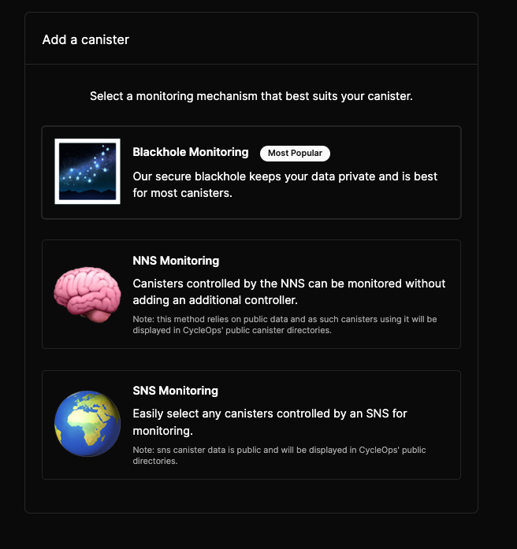

# FAQ

(Have a question that isn’t answered here? Let us know at [contact@cycleops.dev](mailto:contact@cycleops.dev))

## Questions

- [What services does CycleOps provide?](#what-services-does-cycleops-provide)
- [How long does it take for me to set up canister monitoring with CycleOps.](#how-long-does-it-take-for-me-to-set-up-canister-monitoring-with-cycleops)
- [How often do you check cycles balances?](#how-often-do-you-check-cycles-balances)
- [What does CycleOps cost?](#what-does-cycleops-cost)
- [Are there options to monitor my canister other than through the CycleOps blackhole?](#are-there-options-to-monitor-my-canister-other-than-through-the-cycleops-blackhole)
- [Why do I need to add the CycleOps Balance Checker as a controller of my canister in order to have my canister cycles balance monitored?](#why-do-i-need-to-add-the-cycleops-balance-checker-as-a-controller-of-my-canister-in-order-to-have-my-canister-cycles-balance-monitored)
- [How can I trust the code that the CycleOps Balance Checker is running won’t change?](#how-can-i-trust-the-code-that-the-cycleops-balance-checker-is-running-wont-change)
- [What is a Black-holed Canister?](#what-is-a-black-holed-canister)
- [I’d like to integrate with CycleOps in a different way. Can I add an endpoint that CycleOps can monitor?](#id-like-to-integrate-with-cycleops-in-a-different-way-can-i-add-an-endpoint-that-cycleops-can-monitor)
- [I'm unable to add an NNS Monitored canister, why?](#im-unable-to-add-an-nns-monitored-canister-why)
- [My canister is showing up as pending, what does that mean?](#my-canister-is-showing-up-as-pending-what-does-that-mean)

### What services does CycleOps provide?
CycleOps is proactive, automated, no-code monitoring for canister applications on the Internet Computer.

Running for 20 months with zero downtime, CycleOps provides reliable and comprehensive canister monitoring, including:
- Automated cycle topups ⚡️ - keeping your canisters running and your customers happy
- Email notifications ✉️ - notifying you in a variety of scenarios including when your canisters are topped up or when your account balance runs low
- Historical canister metrics and charts 📊
- Proactive alerting, such as canister memory threshold alerts 🚨
- Project analysis with project groups 📂 and canister tags 🏷️

### How long does it take for me to set up canister monitoring with CycleOps.

CycleOps takes [less than 10 minutes ⏳ to set up](./getting-started.md) get started, and doesn't require adding a single line of code to your canister. Setting up subsequent canisters with monitoring takes less than a minute.

### How often do you check cycles balances?

Currently CycleOps checks cycles balances once every **6 hours** and performs top-ups accordingly. 

Want more frequent top-ups? Let us know at [contact@cycleops.dev](mailto:contact@cycleops.dev) or on [X](https://x.com/CycleOps).

### What does CycleOps cost?

CycleOps charges a 5% margin on all canister cycles top-ups. 

If you pay for top-ups in:

- ICP: This is reflected in the ICP per trillion cycles displayed at the top right of your CycleOps Dashboard
- Cycles: a flat 5% fee in cycles is applied to every top-up.

### Are there options to monitor my canister other than through the CycleOps blackhole?

1. **(Most Popular) Blackhole monitoring** - uses the CycleOps blackhole to monitor your canisters, with the added benefit of keeping your canister metric data private
2. **(New) NNS Monitoring** - requires that you add the NNS Root `r7inp-6aaaa-aaaaa-aaabq-cai` as a controller of your canister. Choosing this option means your metric data is public as anyone can monitor it through the NNS Root.
3. **(New) SNS Monitoring** - allows you to monitor canisters belonging to any SNS.

### Why do I need to add the CycleOps Balance Checker as a controller of my canister in order to have my canister cycles balance monitored?

CycleOps provides a **no-code integration** for monitoring your canisters. This means that you do not need to add a single line of code to your canister or application.

Update: As of July 2024, CycleOps now provides [additional no-code monitoring options](#are-there-options-to-monitor-my-canister-other-than-through-the-cycleops-blackhole) for developer teams depending on the type of canister you want to monitor, preferred monitoring mechanism, and visibility of metric data (public or private).

For private canister metric monitoring, the CycleOps Balance Checker calls the Management Canister’s [canister_status](https://internetcomputer.org/docs/current/references/ic-interface-spec/#canister-status) API, which allows only the controller of a canister to call it. 

The Balance Checker canister, canister id `5vdms-kaaaa-aaaap-aa3uq-cai`, is [black-holed](#what-is-a-black-holed-canister) (has 0 controllers), and only contains code that allows it to check the status of other canisters it controls. To verify the wasm binary running in the Balance Checker and black-hole status of the canister for yourself, check out the source code at https://github.com/CycleOperators/BalanceCheckerVerification

### How can I trust the code that the CycleOps Balance Checker is running won’t change?

The CycleOps Balance Checker is [black-holed](#what-is-a-black-holed-canister1), and the source code for it is public at https://github.com/CycleOperators/BalanceCheckerVerification. 

There, you can follow the steps listed in the repository to:

- Verify that the wasm hash of the canister code is the same as the Balance Checker canister `5vdms-kaaaa-aaaap-aa3uq-cai` running on main net
- Review the [Balance Checker code](https://github.com/CycleOperators/BalanceCheckerVerification/blob/main/blackhole.mo), to ensure it is not able to do anything except check the statuses of other canisters.

### What is a Black-holed Canister?

A black-holed canister is akin to a traditional immutable smart contract on Ethereum. On the Internet Computer, a blackhole canister must have the following qualities:

1. Has 0 controllers, controls itself, or is controlled by another blackholed canister. 
2. Does not contain any code that would allow one to upgrade the wasm binary “code” running inside of itself.
3. Must be open sourced with a reproducible build mechanism (in order to verify point #2).

**All three of these points** must be satisfied in order to say that an canister has been blackholed and is immutable.

By being both open sourced and immutable, users can inspect, and interact with, and depend upon blackholed canisters on the Internet Computer in a trustless manner, without a third party or intermediary.

### I’d like to integrate with CycleOps in a different way. Can I add an endpoint that CycleOps can monitor?

Update as of December 2024: [CycleOps now has additional monitoring mechanisms](#are-there-options-to-monitor-my-canister-other-than-through-the-cycleops-blackhole), but no direct API integration yet. Once the [scalable messaging model](https://forum.dfinity.org/t/scalable-messaging-model/26920) is released, we have plans to support secure direct API integration.

Until the scalable messaging model is released, direct API integration as various security issues, specifically in that awaiting an inter-canister call to a 3rd party a malicious user could add a canister and then jam up the Balance Checker canister by doing something like this [GitHub - nomeata/ic-barrier: Delay responses on the Internet Computer, for testing and other purposes](https://github.com/nomeata/ic-barrier).

Specifically [this part](https://github.com/nomeata/ic-barrier#caution). A “locked” canister could suspend the balance checker in perpetuity, with no way to discard the await [Zero-downtime upgrades of Internet Computer canisters – Blog – Joachim Breitner's Homepage](https://www.joachim-breitner.de/blog/789-Zero-downtime_upgrades_of_Internet_Computer_canisters)

A fool-proof solution would either require the IC to implement named callbacks, or to send out a one shot call and then have the user canister send a one shot call back to us (it gets a bit trickier from a UX perspective). Hopefully now that the Bitcoin integration work is winding down, the named callbacks feature (when it comes out) can help us support this!

https://forum.dfinity.org/t/messaging-guarantees/17154/27

### I'm unable to add an NNS Monitored canister, why?

Adding an NNS monitored canister requires that you first add the NNS Root, [r7inp-6aaaa-aaaaa-aaabq-cai](https://dashboard.internetcomputer.org/canister/r7inp-6aaaa-aaaaa-aaabq-cai) as a controller of your canister.

### My canister is showing up as pending, what does that mean?

This means that you have added a canister to your CycleOps account, but the monitoring mechanism the canister was added with (balance checker, nns, or sns root) is not controller of your canister.

Pending canisters are not actively monitored by CycleOps, and do not receive automated topups, nor do they generate email alerts.