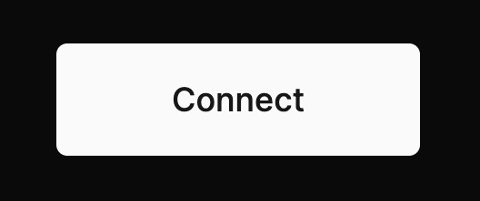
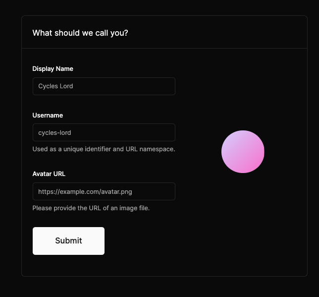
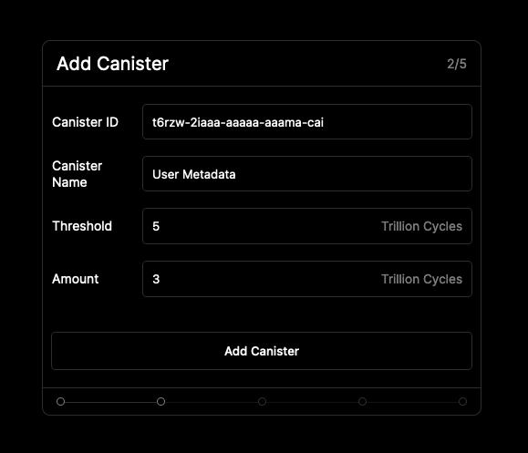
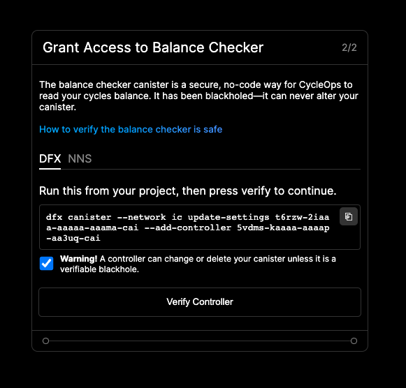
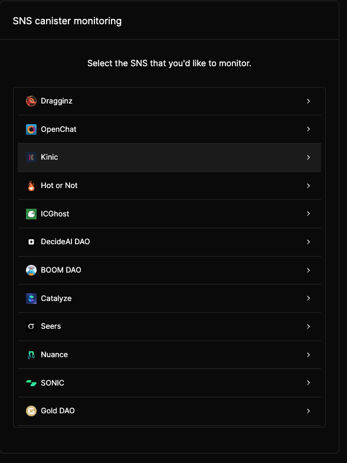
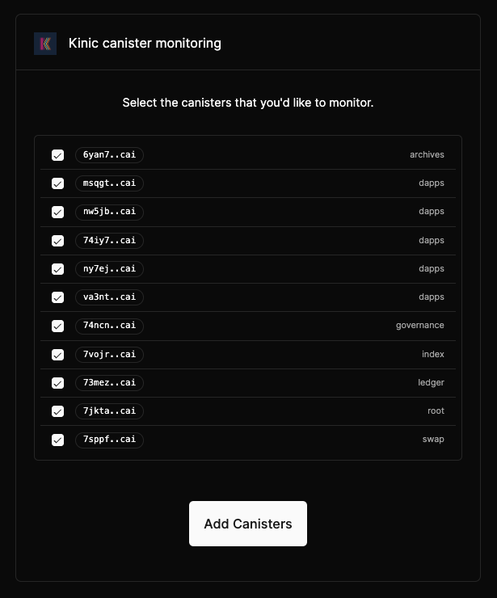
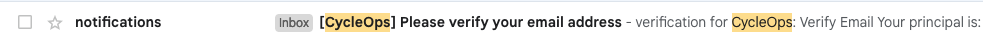
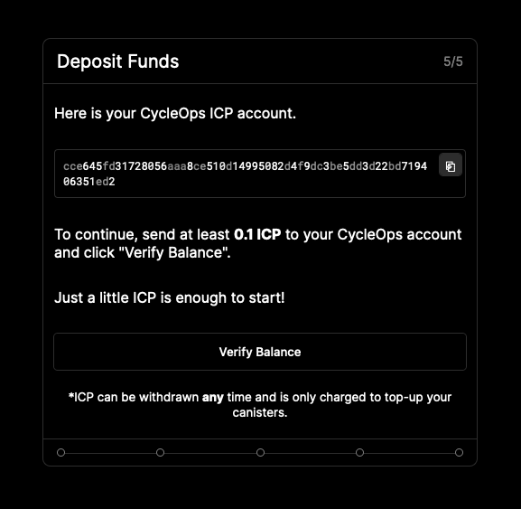

# Getting Started

Hey there, welcome to CycleOps 👋

Let's get you set up so you can kick back 🍺 and stop worrying about your canisters freezing up 🥶

First, let's head over to https://cycleops.dev/. Click the "Connect" button at the bottom of the page to log in with Internet Identity and set up your account.

### Onboarding (takes < 10 minutes)

1. Click Begin and (optional) personalize your account by providing an username, display name, and avatar url

2. Choose the Type of Canister Monitoring that you'd like to set up

   

   1. Blackhole monitoring uses the CycleOps blackhole to monitor your canisters, with the added benefit of keeping your canister metric data private
   2. NNS Monitoring requires that you add the NNS Root ("r7inp-6aaaa-aaaaa-aaabq-cai") as a controller of your canister. Choosing this option means your metric data is public as anyone can monitor it through the NNS Root.
   3. SNS Monitoring allows you to monitor canisters belonging to any SNS. If you choose this option, skip to step 5

3. **(Blackhole or NNS Monitoring) Add Canister**

   1. Add the Canister ID of the first canister 🛢️ that you wish to monitor 🔍
   2. (Optional) Add a friendly "display name" for that canister.
   3. Provide a "Topup Rule" for the canister. To do this:

      1. Enter a **cycles threshold** (in trillions), below which CycleOps will top up the canister
      2. Enter a **cycles amount** (in trillions) to top up this canister if it falls below the threshold you provided

      

4. **(Blackhole Monitoring only) Grant Access to Balance Checker** 🤝
   \*\*\*\*This step is asking you to provide the CycleOps Balance Checker access to read your canister's cycles balance.

The CycleOps Balance Checker is black-holed and can only check the status of canisters of which it is controller, but don't take our word for it ❗ - the code is public at https://github.com/CycleOperators/BalanceCheckerVerification, and you can verify the blackhole status and wasm hash running on main net by either: 1. Using the [GitHub Action verification instructions](https://github.com/CycleOperators/BalanceCheckerVerification#easy-mode-use-a-gh-action) to fork the repository and run a GitHub action which verifies the controllers and wasm hash of the Balance Checker canister. 2. (Mac only) Checking out the https://github.com/CycleOperators/BalanceCheckerVerification repository locally and running `npm run verify-blackhole`. (For local verification, note that the blackhole was built with dfx 0.13.1).

    **Before continuing with verification**, if you run into any issues or are unsure about adding the Balance Checker as a controller, please reach out to us at [contact@cycleops.dev](mailto:contact@cycleops.dev).

    If you're ready to continue, copy and run the dfx command provided to you, which will set the Balance Checker as a controller of your canister, and then click "Verify Controller" to confirm that you have completed this action.

5. **SNS Monitoring**
   Select your canisters' SNS, and then individually select the canisters you'd like to monitor, then click "Add canisters".

Adding an SNS can take 10-20 seconds, so after clicking "Add canisters", sit back and relax 🏝️.

**_Note:_** Adding SNS canisters currently adds them to your CycleOps account with a default [top up rule](./basics/topup-rules) of "when below 10 trillion cycles, top up with 5 trillion cycles". After several days of monitoring, we recommend checking back in 👀 with your CycleOps dashboard and adjusting this top up rule based on the per-canister burn rate 🔥 and time to freeze 🥶 estimate metrics that CycleOps provides.

6. **Configure Notifications** 🔔
   Provide the email address 📩 you wish to receive canister top-up notifications at, as well as which notifications (top-up success, failure) you would like to receive for this canister. Top up failure notifications help to indicate if there was an issue topping up your canister for any reason.

On clicking save, a confirmation email titled "[CycleOps] Please verify your email address" will be sent out to the address provided. Keep this page open, and navigate to the email.

    

    Inside the email is a confirmation link, which will complete the email verification process.

7. **Deposit Funds** 🪙
   Almost there! You are now at the final step, depositing funds to your CycleOps account. This ICP is **only** used to top-up your canisters when their cycles balances run low.

Using the account identifier provided, transfer at least 0.1 ICP to CycleOps, and click "verify balance" to continue!

    

🎉 🍻 All done! Your canister will now be periodically monitored once every 6 hours and topped up according to the top-up rules you've provided.

At this point, you can:

- Add more canisters with the "Add canister" button 🚀
- Navigate to the "Settings" tab to:
  - (**Recommended)** Add a **Low ICP Balance** notification if your account ICP balance falls below a certain value after completing a top-up. This ensures your canister top-ups won't fail due to insufficient funds 😅.
  - Modify your existing top-up notification settings.
  - Set memory threshold alerts for individual canisters
