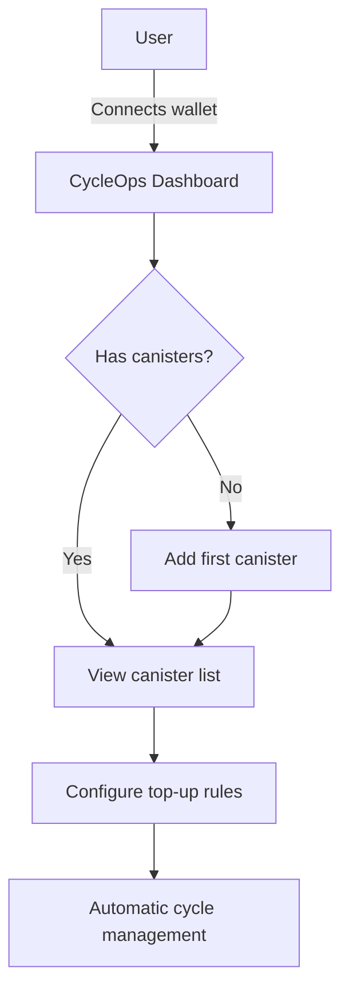
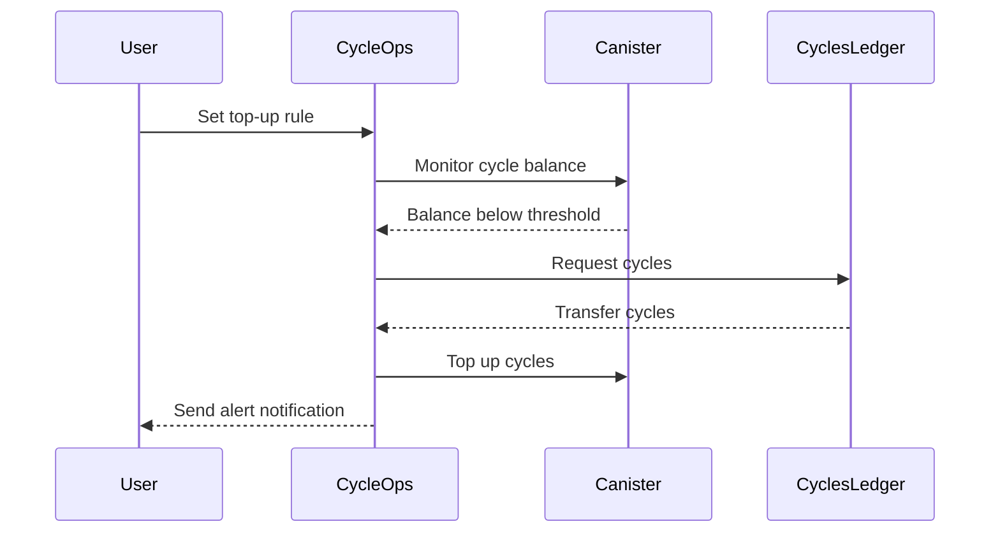
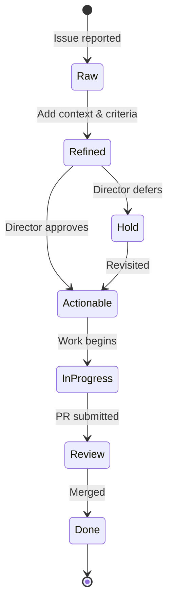
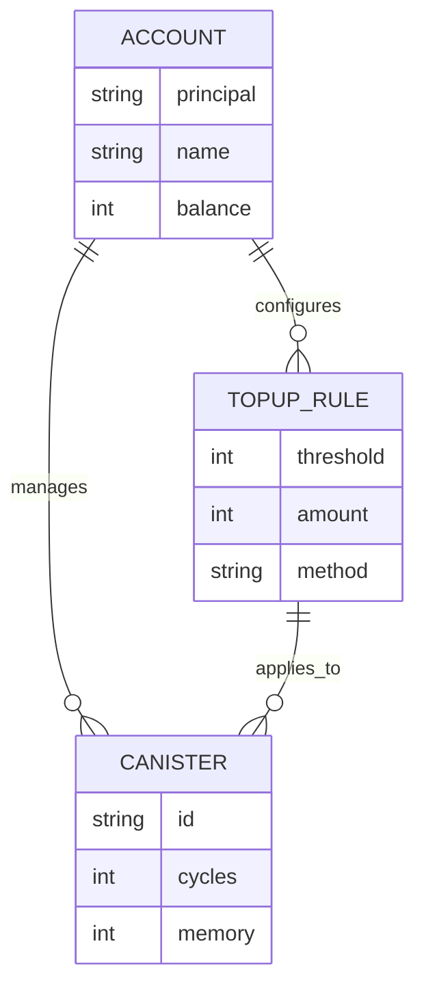
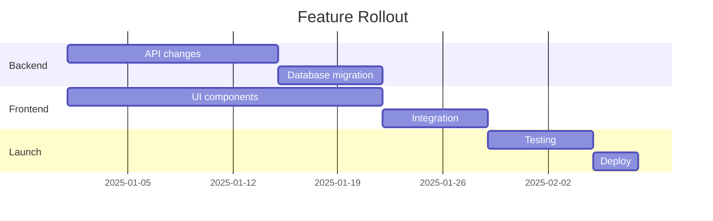
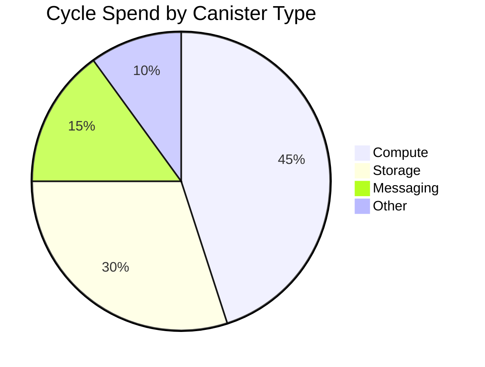
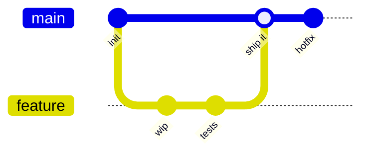

# Mermaid Diagrams Demo

This page demonstrates the various Mermaid diagram types available in our docs. Use these as reference when writing documentation.

## Flowchart



## Sequence Diagram



## State Diagram



## Entity Relationship Diagram



## Gantt Chart



## Pie Chart



## Git Graph



---

:::tip
To use Mermaid in any doc page, wrap your diagram code in a ` ```mermaid ` fenced code block.
See the [Mermaid docs](https://mermaid.js.org/) for the full syntax reference.
:::
