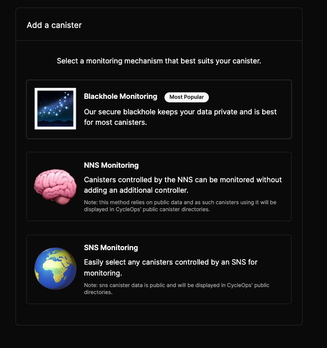
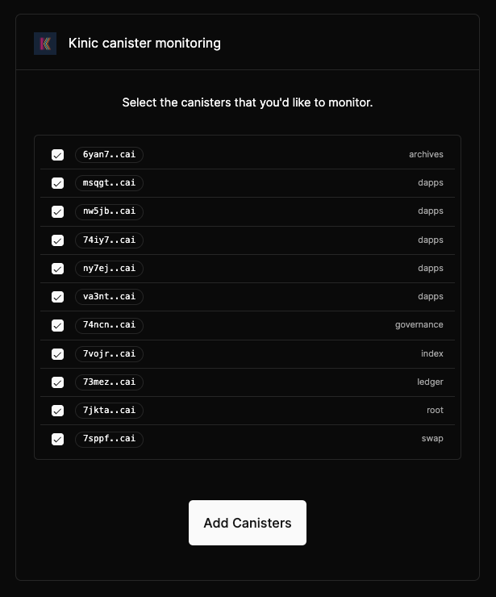
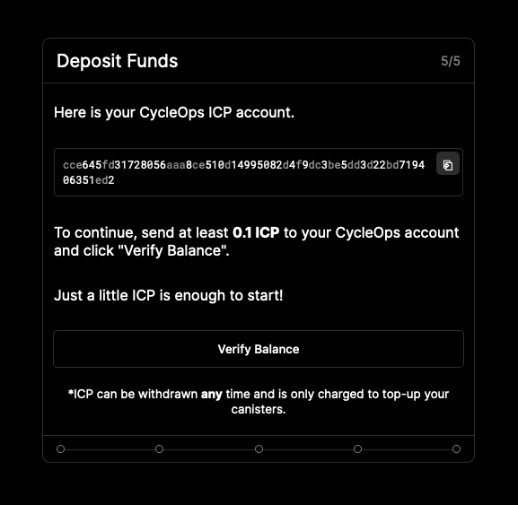

# SNS Monitoring

**Time to complete:** < 10 minutes

**Requirements:** [CycleOps UI](https://cycleops.dev) - 0 code required!

Hey there, welcome to CycleOps 👋

Let's get you set up so you can kick back 🍺 and stop worrying about your SNS canisters freezing up 🥶

First, let's head over to https://cycleops.dev/. Click the "Connect" button at the bottom of the page to log in with Internet Identity and set up your account.

### Onboarding (takes < 10 minutes)

1. Click Begin and (optional) personalize your account by providing an username, display name, and avatar url

2. Choose SNS Monitoring to set up canister monitoring for your SNS

   

3. **SNS Monitoring**
   Select the desired SNS, individually select the canisters you'd like to monitor, and then click "Add canisters".

Adding an SNS can take 10-20 seconds, so after clicking "Add canisters", sit back and relax 🏝️.

**_Note:_** Adding SNS canisters currently adds them to your CycleOps account with a default [top up rule](./basics/topup-rules) of "when below 10 trillion cycles, top up with 5 trillion cycles". After several days of monitoring, we recommend checking back in 👀 with your CycleOps dashboard and adjusting this top up rule based on the per-canister burn rate 🔥 and time to freeze 🥶 estimate metrics that CycleOps provides.

4. **Configure Notifications** 🔔
   Provide the email address 📩 you wish to receive canister top-up notifications at, as well as which notifications (top-up success, failure) you would like to receive for this canister. Top up failure notifications help to indicate if there was an issue topping up your canister for any reason.

On clicking save, a confirmation email titled "[CycleOps] Please verify your email address" will be sent out to the address provided. Keep this page open, and navigate to the email.

    

    Inside the email is a confirmation link, which will complete the email verification process.

5. **Deposit Funds** 🪙
   Almost there! You are now at the final step, depositing funds to your CycleOps account identifier (not principal). This ICP is **only** used to top-up your canisters when their cycles balances run low.

Using the account identifier provided, transfer at least 0.1 ICP to CycleOps, and click "verify balance" to continue!

    

🎉 🍻 All done! Your canister will now be periodically monitored once every 6 hours and topped up according to the top-up rules you've provided.

At this point, you can:

- Add more canisters with the "Add canister" button 🚀
- Navigate to the "Settings" tab to:
  - (**Recommended)** Add a **Low ICP Balance** notification if your account ICP balance falls below a certain value after completing a top-up. This ensures your canister top-ups won't fail due to insufficient funds 😅.
  - Modify your existing top-up notification settings.
  - Set memory threshold alerts for individual canisters
