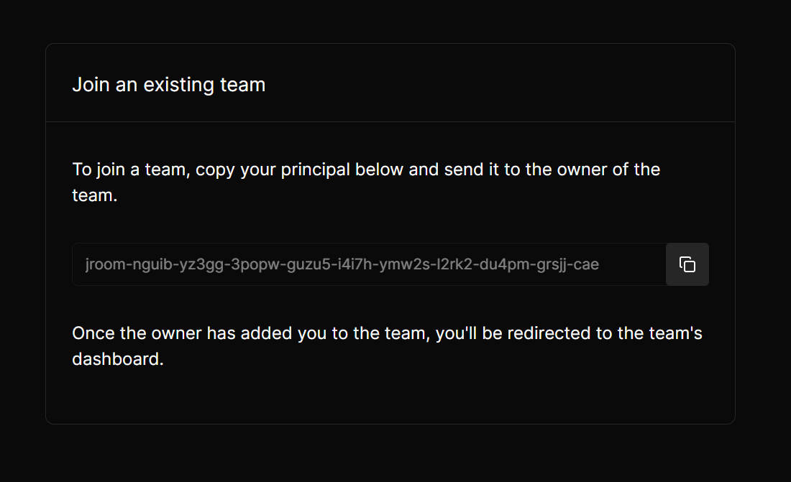
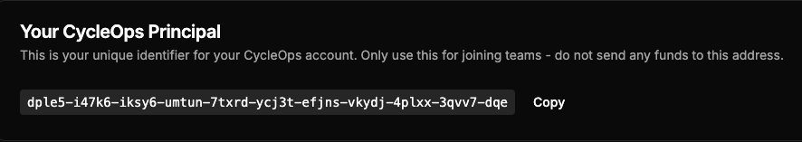
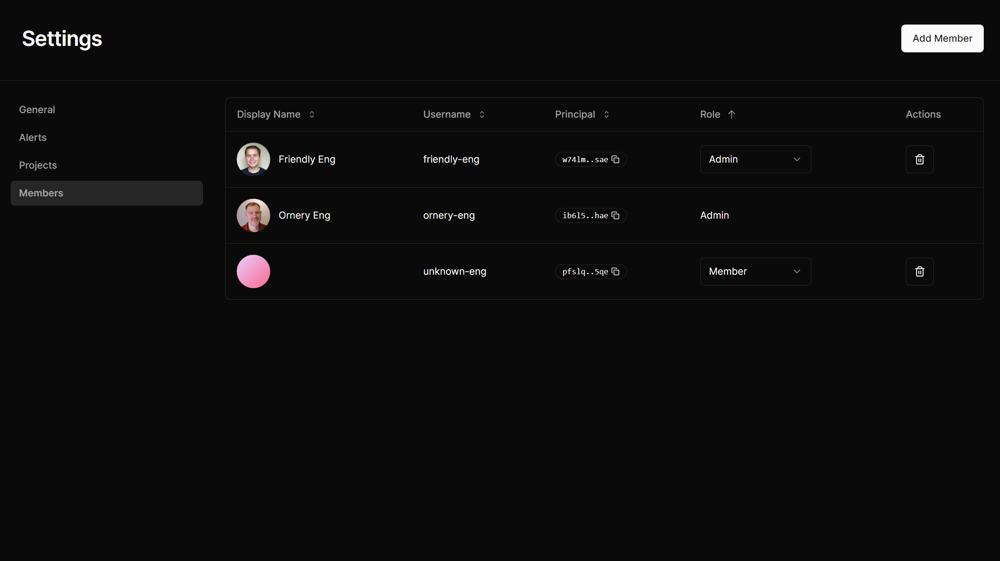
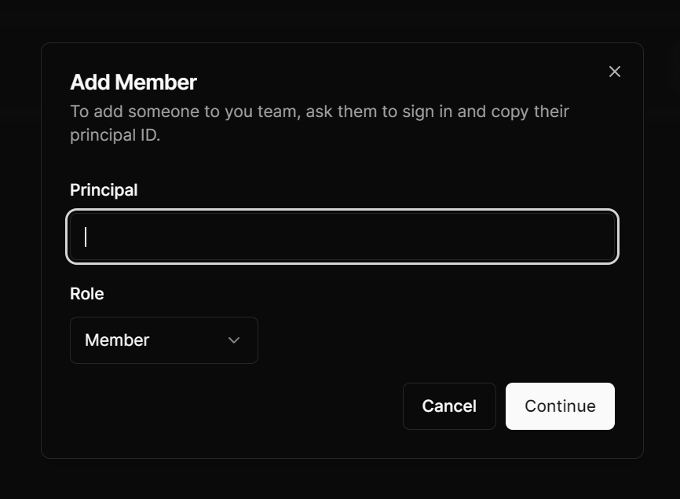
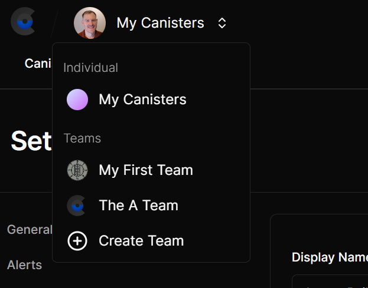
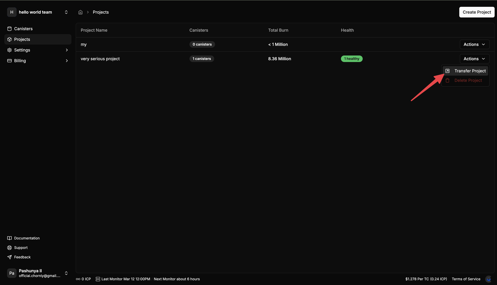

# Teams Management

Team member management in CycleOps relies on your user principal, which is like a unique user id. In short, the individual who wishes to join a team must send their principal to the team admin 👩‍💻, who can then add them to the team.

## Joining A Team

You’ll need a CycleOps account, so set one up if you haven’t already by heading to [cycleops.dev](http://cycleops.dev) and connecting your Internet Identity.

Send a message on your favorite comm’s app to the team admin and let them know you’ll be sending them your CycleOps principal in just a minute ⏰ (and maybe give them a compliment while you’re at it? 😅)

### Locating Your User Principal

If you created a new account (by logging in to CycleOps), first select the option to “join an existing team” during the onboarding process. This will present you with a screen like the one below, where you can copy your principal with a simple click.

You can also always find your principal in the dropdown at the top right of the app, as long as you’re logged in. Your principal is displayed at the top, and you can click on it to copy it to your clipboard.

## Adding A Team Member

To add an individual to your team, you’ll need their CycleOps principal. If they’re not sure how to do that, share a link to this documentation with them

Navigate to the settings page for your team, and you’ll see a link to member settings in the sidebar. From here, click the “Add Member” button in the top right to open a new dialog window.

In this dialog, you can paste in the individual’s principal, and determine which role you want them to have.

**Admins** - have **full control** of the team account including:

- ✅ Adding, removing, or changing the roles of any team member (including the original creator of the team)
- ✅ Altering the payment method, viewing the current account balance, transaction history, and withdrawing funds from the account (if paying with ICP)
- ✅ Transfer all canisters with project to their individual account or another team account that they are an admin of
- ➕ all privileges included in the member role

**Members can:**

- ✅ Add or remove canisters and adjust canister top up rules
- ✅ Add or remove projects and modify canister tags
- ✅ Modify the notification email address and email notification settings (alerts and thresholds)

- ❌ Not allowed to perform or view any actions related to payments
- ❌ Not allowed to perform or view any actions related to team member management
- ❌ Not allowed to transfer projects

## Creating a Team

Of course, the first order of business is create a team if haven’t already. You can create a team by opening the account dropdown in the top left of the app and selecting “Create Team”.

\***\*Note: Each team has a separate billing account** (not the same as your individual account), so make sure to fund your team account appropriately. T**eams also have separate notification settings**. By default, creating a team copies over your notification settings from your individual account, so make sure to adjust them from the settings page as desired (e.g. if you want your entire team to receive emails).

If you’re already monitoring a bunch of canisters that you’d like to transfer into your new team, you easily do that from your project settings.

From the Settings → Projects page:

1. Add all of the canisters that you want to move to your team to a project. If no projects exist, you can create a project by clicking on the “+ Create New project” button.
2. Click on the settings menu for that project, and select “Transfer Project.”
3. Transfer the project to the intended team account.

Note: A project can be transferred from a team account back to an individual account by a team admin.

