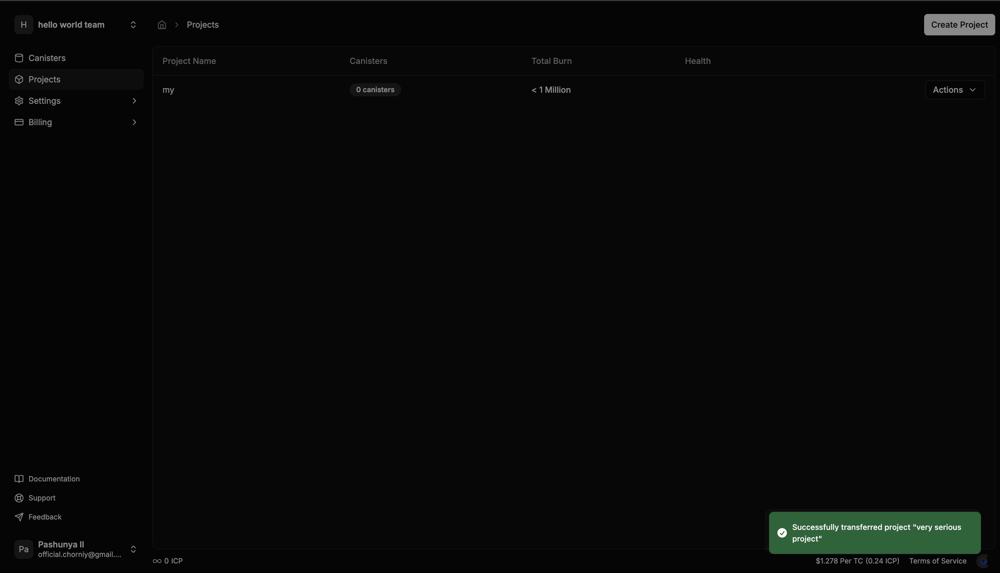

# Transferring Canisters Between Teams

This guide will walk you through the process of transferring canisters between different teams in CycleOps. Transferring canisters is done by assigning them to projects and then transferring the entire project.

## Prerequisites

- You must have an active CycleOps account
- You need to be an admin of the team from which you want to transfer the canister
- The canister must be added to your CycleOps monitoring

## Step-by-Step Process

### 1. Open Canister Details

Navigate to your CycleOps dashboard and locate the canister you wish to transfer. Click on the canister name to open its details page.

### 2. Access Settings

Within the canister details view, locate and click on the "Settings" tab in the top navigation bar.

### 3. Navigate to Organization Settings

In the settings menu, find and select the "Organization" option. This section allows you to manage how your canister is organized within your CycleOps account.

### 4. Assign Canister to a Project

If your canister is not yet assigned to a project, you'll need to do this first:

1. In the Organization section, you'll see a dropdown or selection menu for projects
2. Either select an existing project or create a new one on the "Project" page first and then select from the dropdown

> **Note**: A canister must be part of a project before it can be transferred between teams.

### 5. Go to Projects Page

After assigning your canister to a project, navigate to the main "Projects" page from the primary navigation menu.

### 6. Access Project Actions

On the Projects page, you'll see a list of all your projects. Find the project containing the canister you want to transfer.

Next to the project name, locate the "Actions" button and click on it to reveal a dropdown menu.

### 7. Select Transfer Destination

In the Actions dropdown menu, select "Transfer Project." A dialog will appear asking you to select the destination team.

Choose the team you want to transfer the project (and its canisters) to from the dropdown list.

After selecting the destination team, click the "Continue" button to initiate the transfer.

> **Note**: You will only be able to see teams where you have admin privileges.

### 8. Transfer Complete

Once the transfer is complete, you'll see a success message. The project and all its associated canisters will now be managed by the selected team.

> **Important**: After transfer, top-up rules, notification settings, and other configurations will be maintained, but will now operate under the destination team's payment method and account balance.

## Permissions Required

- **Team Admins** can transfer projects to any other team where they have admin privileges
- **Team Members** cannot transfer projects

## Troubleshooting

If you encounter any issues during the transfer process:

- Ensure you have admin privileges in both the source and destination teams
- Verify that the canister is properly assigned to a project
- If the transfer fails, try refreshing the page and attempting the transfer again

For any further assistance, contact CycleOps support at [Twitter](https://x.com/CycleOps)